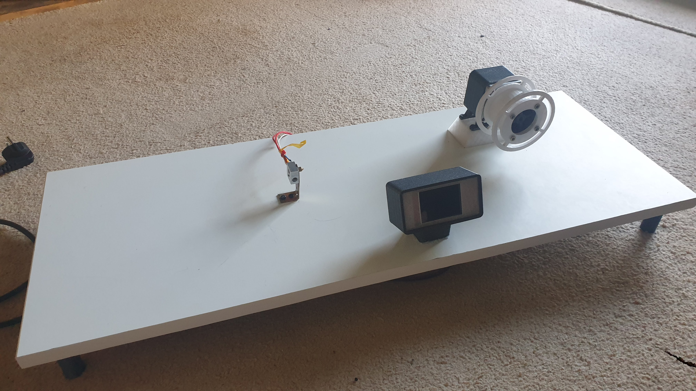
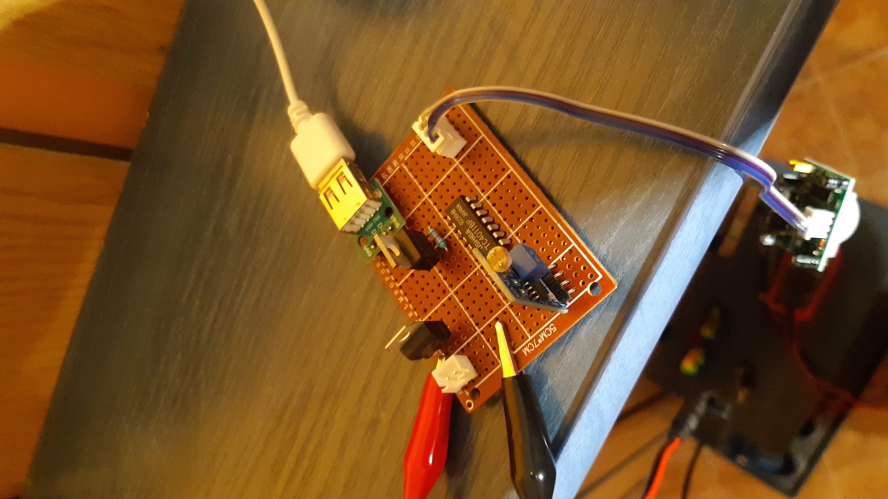
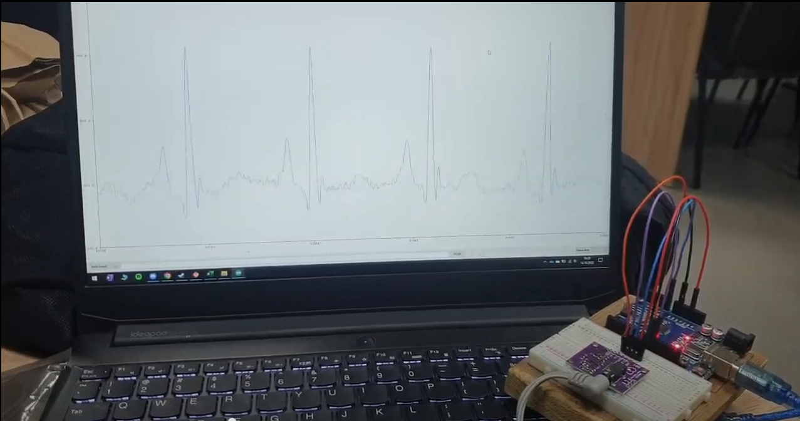
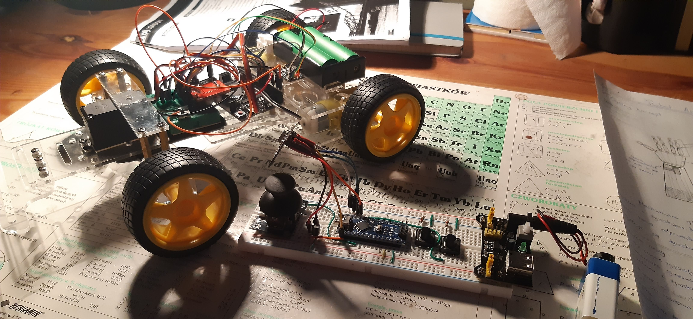
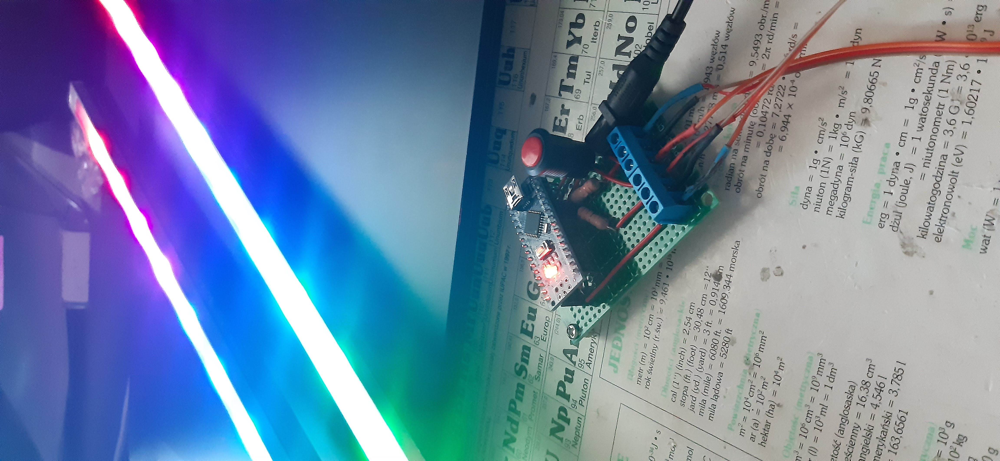
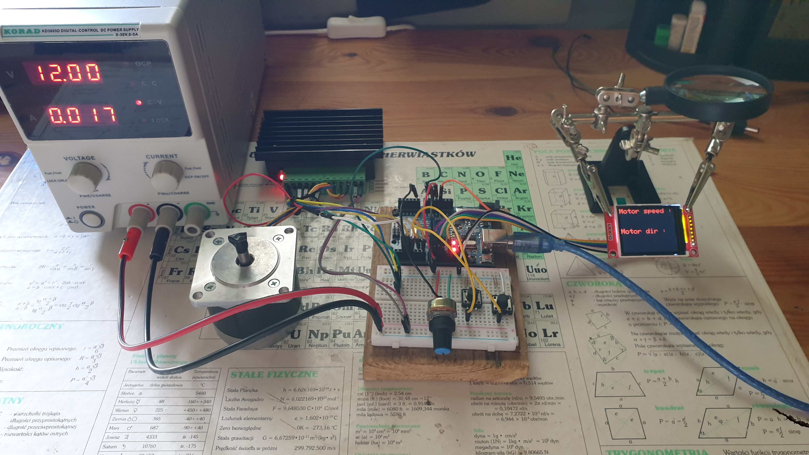
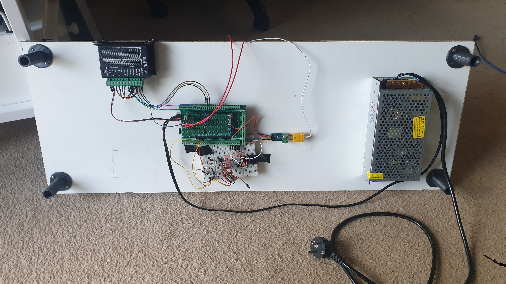

# Arduino-sketchbook
---
### File desctiption
- BLELed
- Bluetooth music
- button
- Buzzer
- CameraWebServer
- Czujnik alkoholu
- dystans
- ecg
- exampleMX1508
- game_platform
- graphicstest
- gyro
- gyro_servo
- IR
- joystick
- Knob
- max6675
- napis_na_oled
- nRF24
- powerDownWakeExternalInterrupt
- pressure and temp
- RC Car
- smartBlindsNoLib
- smartBlinds
- stepper
- swiatloCUP
- temp_i_wilgoc
- TempHumPress
- touchResistance
- TouchTest
- WS2812b

### Some images

